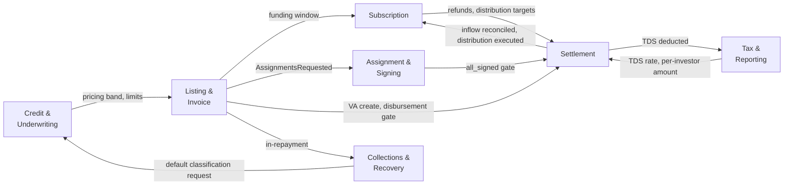
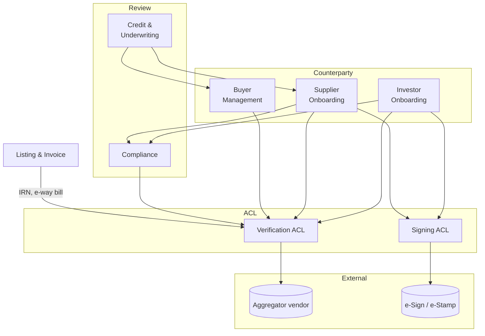

# B1 — Bounded Contexts & Context Map

*Phase 1 MVP. Conceptual division of the platform into bounded contexts, with each context's responsibility, its key aggregates, and how it integrates with neighbours. Inputs: Decision Log, Product Spec, A1 Constraints, A2 Integration Contracts. Output: anchor for event model (B2), aggregate design (B3), and deployment topology decisions (Spec §9 — Architect).*

A bounded context is a slice of the domain with its own ubiquitous language, lifecycle, and rate of change. It need not be a separate service. The Architect decides whether each context becomes a module in a monolith or a standalone service; this document is deployment-agnostic.

---

## 1. Context Inventory

Nineteen contexts. Six core, three counterparty, four platform/oversight, three generic, three integration ACLs.

### 1.1 Core domain (the heart)

**BC1. Listing & Invoice.**
Owns invoice intake (IRN auto-fetch + manual fallback), operational checks, and the listing state machine end-to-end from `draft` to `closed`. Coordinates buyer acknowledgment, pricing application, listing go-live, funding-window closure, and emits the events that drive funding, assignment, disbursement, repayment, and distribution.
*Aggregates:* Invoice, Listing. *Refs:* DL-016, DL-017, DL-019, DL-024, DL-027, Spec §4.1, §6.4. *Constraints:* C12, C24.

**BC2. Subscription.**
Owns the per-investor commitment to a listing through its full lifecycle: `committed` → `funds_pending` → `funds_received` → `confirmed` → `assignment_executed` → distribution → `closed`. Enforces ₹10K minimum, soft concentration warnings, and pre-confirmation cancellation. Strict equality on rupee value at the listing's VA balance (G10).
*Aggregates:* Subscription. *Refs:* DL-007, DL-009, DL-011, DL-044, Spec §6.5. *Constraints:* C12, C16, C21.

**BC3. Credit & Underwriting.**
Owns credit policy: pricing bands per buyer/tenor, buyer credit limits, supplier risk profiles, concentration defaults, default classification, and exception adjudication. Threshold four-eyes (≤ ₹1 Cr single, > ₹1 Cr second approver) is a workflow primitive here. Publishes effective values that Listing & Invoice snapshots at go-live time.
*Aggregates:* BuyerCreditProfile, SupplierCreditProfile, PricingPolicy, DefaultCase. *Refs:* DL-022, DL-023, DL-024, DL-025, DL-029. *Constraints:* C6.

**BC4. Settlement.**
Owns the platform side of money movement. Instructs disbursement, distribution, refund, and TDS deduction through the Banking ACL. Runs the reconciliation engine (real-time per-webhook + EoD master-statement overlay, G6). Maintains the Manual Remediation queue for failed payout legs (G11). Snapshots per-investor TDS into the instruction payload at instruction time (G4). Treasury & Settlement role gates every instruction.
*Aggregates:* PayoutInstruction, ReconciliationLedger, RemediationCase. *Refs:* DL-030, DL-043, DL-044, DL-045, Spec §4.1. *Constraints:* C8, C9, C11, C12, C22, C23.

**BC5. Assignment & Signing.**
Owns the business orchestration of legal-document execution. Three flows in Phase 1: MAA at supplier onboarding, MIA at investor onboarding, and per-investor assignment doc on listing 100%-funded transition. Holds the aggregate signature state (`all_signed` gates disbursement per C27); enforces the 24-hour time-box on per-investor assignment (G13). Delegates technical vendor interaction to the Signing ACL.
*Aggregates:* MasterAgreement, AssignmentSet, SignatureRequest. *Refs:* DL-002, DL-048, Spec §4.1 step 8. *Constraints:* C1, C2, C27.

**BC6. Collections & Recovery.**
Owns post-disbursement maturity tracking and the delay state machine: `on_track` → `mildly_delayed` (T+1–7) → `delayed` (T+8–15) → `seriously_delayed` (T+16–30) → `under_adjudication` → outcome (`disputed`, `dilution_claim`, `fraud_claim`, `defaulted`, `recovered`). Orchestrates soft collections (in-house, T to T+15) and hard collections (panel-lawyer escalation, T+16+). Hands off classification to Credit & Underwriting; never declares default automatically.
*Aggregates:* MaturityCase, CollectionsAction, ClaimCase. *Refs:* DL-028, DL-029, Spec §4.2. *Constraints:* C2.

### 1.2 Counterparty contexts (supporting)

**BC7. Investor Onboarding.**
Owns invite-code lifecycle (single-use, 14-day, bound to email+phone hash at issuance — G9), the eight-stage investor journey, suitability assessment with explicit override-acknowledgment, MIA orchestration via Assignment & Signing, and the investor account through to `active`. Annual KYC refresh runs from here.
*Aggregates:* Invite, InvestorAccount, KycFile, SuitabilityAssessment. *Refs:* DL-005, DL-006, DL-007, DL-008, DL-036, DL-050, Spec §2.4. *Constraints:* C17, C20, C21.

**BC8. Supplier Onboarding.**
Owns the six-stage supplier journey, the "acting-on-behalf" agency consent artefact (G5), supplier financial profile capture, MAA orchestration, and the supplier account through to `active`. Every admin action under agency is independently audit-logged with the consent reference; "Acting as Supplier X" mode is a UI artefact backed by enforced agency scope.
*Aggregates:* SupplierAccount, AgencyConsent, KycFile, FinancialProfile. *Refs:* DL-012, DL-013, DL-014, Spec §2.2. *Constraints:* C2, C17, C24.

**BC9. Buyer Management.**
Owns the four-stage buyer journey (nomination → identity → engagement → active), the minimal buyer portal users, authorised acknowledgment users, NOA execution, and payment instructions. Three relationship tiers are schema-supported; only `acknowledged_buyer` is active in Phase 1. Credit decisions about buyers live in Credit & Underwriting; this context consumes them.
*Aggregates:* BuyerAccount, AcknowledgmentUser, PaymentInstruction. *Refs:* DL-018, DL-019, DL-020, DL-021, Spec §2.3. *Constraints:* C24.

### 1.3 Platform & oversight contexts

**BC10. Admin IAM.**
Owns admin user accounts, the five composable roles, role assignment, RBAC permission resolution, MFA enrolment and challenge, the two-tier SoD enforcement (strict system-block + soft warn-with-override-logged), the Managed Deviation Register, the record-level maker-checker primitive consumed across other contexts, and the tenant-isolation claims that downstream contexts use to filter reads.
*Aggregates:* AdminUser, RoleAssignment, DeviationEntry, SodPolicy. *Refs:* DL-031–036, Spec §3. *Constraints:* C4, C5, C6, C7, C16, C18.

**BC11. Compliance.**
Owns AML/PEP screening at onboarding (one-time in Phase 1; re-screening dormant per DL-037), internal-only SAR documentation, annual KYC refresh scheduling, and audit-trail spot-checks. Approves investor and supplier KYC files. The Compliance Reviewer role lives here; invite-issuance authority sits with this role per DL-036.
*Aggregates:* AmlScreening, SarCase, KycRefreshSchedule, SpotCheck. *Refs:* DL-036, DL-037, DL-038, Spec §7.2. *Constraints:* C17, C21.

**BC12. Tax & Reporting.**
Owns TDS rate logic (applicability per investor profile and PAN status), per-investor TDS calculation at distribution time (output snapshotted into Settlement's instruction payload — G4), annual Form 16A issuance using escrow challan refs, monthly portfolio statements, and tax-quarter aggregations. Form 26Q filing ownership is split between escrow vendor and panel-CA per G12.
*Aggregates:* TaxYearProfile, TdsDeduction, InvestorStatement. *Refs:* DL-045, Spec §2.4, §4.1 step 12. *Gaps:* G4, G12.

**BC13. Auditor Access.**
Owns just-in-time auditor account provisioning (time-bound, scoped by date range / entity type / sensitivity), export rate-limiting, scoped read-only admin-UI views and read-only APIs that share underlying permissions. Account-level SoD bars auditor accounts from holding any operational role. Founders performing internal audit use dedicated audit-only accounts.
*Aggregates:* AuditorAccount, AccessScope. *Refs:* DL-039, DL-041, DL-042, Spec §2.7. *Constraints:* C3, C19.

### 1.4 Generic subdomains

**BC14. Audit Log.**
Append-only, immutable event substrate. Every state-changing action, sensitive read, approval/override, role change, agency action, fund-movement instruction, webhook event, and auditor activity is written here. Cryptographic chaining + WORM substrate; 10-year retention; no role (including Super Admin) can modify or delete. Storage substrate choice is G7.
*Aggregate:* AuditEvent (write-only). *Refs:* DL-040, Spec §7.1. *Constraints:* C1, C2, C3. *Gap:* G7.

**BC15. Notifications.**
Transactional dispatch via email + SMS through a vendor-neutral abstraction. OTPs, acknowledgment requests, maturity reminders, listing status updates, statement delivery, admin alerts, status-banner events on integration outages. No WhatsApp, no in-app, no push in Phase 1.
*Aggregate:* NotificationDispatch. *Refs:* DL-049, Spec §5.4.

**BC16. Documents.**
Encrypted document custody — KYC documents, financial statements, signed PDFs, e-stamp certificates, vendor payload archives kept verbatim per A2 §4. India-resident; retention aligned with Audit Log (10 years). Content-addressable storage (SHA-256 keys); the hash is what Audit Log entries reference, not the binary.
*Aggregate:* DocumentObject. *Refs:* Spec §7.3, §7.4, A2 §4 (verbatim-payload rule). *Constraints:* C13, C14, C15. *Gap:* G15.

### 1.5 Integration / Anti-Corruption Layers

**BC17. Verification (Aggregator ACL).**
Wraps the single aggregator vendor (DL-026, DL-047). Translates vendor model into domain commands: `verify_pan`, `verify_aadhaar_ekyc`, `verify_gstin`, `fetch_mca21`, `fetch_gst_returns`, `fetch_bureau`, `fetch_aa_bank_statement`, `verify_penny_drop`, `verify_irn`, `verify_eway_bill`, `screen_aml_pep`. Owns TTL management per data type (A2 §1.4), manual-fallback escalation (G8), HMAC webhook verification, and idempotency by `client_request_id`.
*Refs:* A2 §1, DL-026, DL-047, DL-050. *Constraints:* C10, C24. *Gaps:* G8, G16.

**BC18. Banking (Escrow ACL).**
Wraps the single escrow provider (DL-046). Translates vendor model into domain commands: `create_va`, `close_va`, `instruct_payout_single`, `instruct_payout_multi_leg`, `instruct_refund`, `fetch_master_statement`. Owns HMAC verification, idempotency by `client_instruction_id`, dead-letter queue, vendor-event-id dedupe, and the EoD master-statement parser whose output Settlement reconciles against.
*Refs:* A2 §2, DL-043, DL-044, DL-045, DL-046. *Constraints:* C8, C9, C10, C22, C23. *Gaps:* G1, G6, G11.

**BC19. Signing (e-Sign / e-Stamp ACL).**
Wraps signing + stamping vendors, likely a single orchestration vendor per G14. Translates vendor model into domain commands: `init_signature`, `await_completion`, `fetch_signed_doc`, `issue_stamp`. Handles the Aadhaar-OTP and DSC paths, UIDAI-outage degradation (A2 §3.6), and emits signature-event envelopes that Audit Log and Documents consume.
*Refs:* A2 §3, DL-048. *Constraints:* C10, C14. *Gaps:* G2, G14, G15.

---

## 2. Shared Kernel

A deliberately small shared kernel. Types only — no business logic. Every context depends on it; every change to it is a multi-context change and treated as such.

- **Money** — paise-precision integer + currency code (INR). All amounts in the system. Never a float.
- **Indian identifier value objects** — `PAN`, `GSTIN`, `CIN`, `IFSC`, `UPI_VPA`, `IRN`, `AadhaarLast4`, `UDYAM` (dormant Phase 1). Self-validating; reject malformed values at construction.
- **BusinessDate** + T+N calculator honouring NEFT/RTGS cutoffs and Indian banking holidays. Used by Settlement (C11), Listing (5-day window), Collections (status transitions).
- **MoneyMovementRef** — UTR, txn_ref, idempotency-key types.
- **AuditEventEnvelope** — the wire format every context uses to publish to Audit Log. Defined once; all contexts conform.

Anything not in this list lives inside a context.

---

## 3. Published Language

Domain events are the platform's published language. Every context emits typed events conforming to `AuditEventEnvelope`. Audit Log subscribes to all; other contexts subscribe selectively to events they care about.

Working assumption for Phase 1 MVP: in-process pub/sub within a modular monolith, with the envelope future-proof for an out-of-process broker in Phase 2 (G17 — new). The Architect decides delivery substrate.

---

## 4. Context Map

### 4.1 Relationship inventory

The headline patterns, by relationship type.

**Customer/Supplier (Up → Down).** Upstream defines the contract; downstream depends on it. Coordinated change.

| Upstream | Downstream | What flows |
|---|---|---|
| Investor Onboarding | Subscription | Investor must be `active` to subscribe |
| Investor Onboarding | Compliance | KYC file routed for approval |
| Supplier Onboarding | Listing & Invoice | Supplier must be `active` to list |
| Supplier Onboarding | Compliance | KYC + agency consent routed for approval |
| Buyer Management | Listing & Invoice | Buyer must be `active`; per-invoice acknowledgment required |
| Credit & Underwriting | Listing & Invoice | Effective pricing band + buyer-limit headroom + supplier exposure cap, snapshotted at listing go-live (G20 — new) |
| Credit & Underwriting | Buyer Management | Buyer credit limit assigned / changed |
| Credit & Underwriting | Supplier Onboarding | Supplier risk profile |
| Listing & Invoice | Subscription | Funding window opens / closes |
| Listing & Invoice | Assignment & Signing | `AssignmentsRequested` on 100%-funded |
| Listing & Invoice | Settlement | VA-create on go-live; disbursement gate on funding + all_signed |
| Listing & Invoice | Collections & Recovery | Disbursed listing enters maturity tracking |
| Subscription | Settlement | Refund instructions on shortfall; distribution targets |
| Assignment & Signing | Settlement | `all_signed` gate releases disbursement |
| Settlement | Subscription | Inflow reconciled → `funds_received`; distribution executed |
| Settlement | Tax & Reporting | Distribution event records TDS deduction |
| Tax & Reporting | Settlement | TDS rate + per-investor amount snapshotted into instruction payload (G4) |
| Collections & Recovery | Settlement | Recovery-payment inflow path |
| Collections & Recovery | Credit & Underwriting | Claim classification request |
| Compliance | Investor Onboarding | Approve / reject KYC file |
| Compliance | Supplier Onboarding | Approve / reject KYC file |

**Open Host Service.** Substrates accessed by many; the substrate publishes a stable interface and downstream contexts conform to it.

| OHS | Consumers | Mode |
|---|---|---|
| Admin IAM | All contexts | Permission resolution, MFA, maker-checker primitive, tenant claims |
| Audit Log | All contexts | Write-only; envelope conformist |
| Notifications | Most contexts | Command dispatch (`send_email`, `send_sms`) |
| Documents | Onboarding ×3, Signing, Compliance, Auditor Access, Tax & Reporting | Store, retrieve-by-hash, signed-URL issuance |

**Anti-Corruption Layer.** Each external vendor is hidden behind a domain-meaningful façade. Vendor model never leaks into business contexts.

| Consumer(s) | ACL | External system |
|---|---|---|
| Investor Onboarding, Supplier Onboarding, Buyer Management, Listing & Invoice, Compliance | Verification (BC17) | Aggregator partner |
| Settlement (sole Phase 1 consumer) | Banking (BC18) | Escrow provider |
| Assignment & Signing (sole Phase 1 consumer) | Signing (BC19) | e-Sign + e-Stamp vendor(s) |

**Conformist.** Auditor Access conforms to other contexts' read models — it reads what they expose, with no influence on their design. All contexts are conformist on the Audit Log event envelope.

**Separate Ways.** Deliberately no direct integration:
- Buyer Management ↔ Subscription. Buyers do not see investor data and vice versa (C16).
- Auditor Access ↔ Notifications. Auditors do not receive transactional notifications; the audit-the-auditor stream is the only output back.

### 4.2 Diagram — core transactional flow

### 4.3 Diagram — onboarding & ACL fan-in

### 4.4 Cross-cutting substrates

Four substrates touch nearly every context. Their consumption pattern is identical; rather than draw N×4 edges, the rule is stated once:

| Substrate | Rule |
|---|---|
| Admin IAM | Every command handler in every context resolves permissions via IAM before mutating state. Maker-checker is enforced at the command-handler layer (C4), not the UI. Tenant-isolation claims (C16) are injected at the repository layer. |
| Audit Log | Every state-changing command, sensitive read, approval, override, role change, agency action, fund-movement instruction, and webhook event writes one envelope to Audit Log before returning success (C1, C2). Auditor reads/exports also write (C3). |
| Notifications | Used by every context that interacts with a human counterparty. Dispatch is fire-and-forget; delivery failure does not roll back business state, but is itself an audit event. |
| Documents | Any file artefact — KYC docs, financials, signed PDFs, e-stamp certs, vendor payload archives — lives here, addressed by SHA-256. Audit Log references the hash; the binary never inlines into events. |

---

## 5. Cross-cutting Concerns

### 5.1 Tenant isolation (C16)

Investors cannot see other investors' subscriptions. Suppliers cannot see other suppliers' invoices or investor identities. Buyers see only their assigned invoices. Exceptions: buyer and supplier identity are disclosed to investors on listings (DL-010, DL-017).

Enforcement is at the repository layer in each context, driven by tenant-isolation claims issued by Admin IAM at session establishment. Never at the UI layer alone. G19 (new) records that the precise claim shape and propagation pattern is an Architect-layer decision.

### 5.2 Idempotency convention

C9 is binding for fund-movement. Extended convention for B1: every command handler that mutates state across contexts is idempotent on `(actor_id, command_id)` — `command_id` being a platform-generated UUID. Replays from upstream are safe; this protects against retry-storms across context boundaries (G18 — implicit; folded into G17 substrate decision).

### 5.3 Pricing band in-flight invariance (G20 — new)

A listing snapshots the buyer's pricing band, supplier exposure cap, and buyer-limit headroom at the `ready_for_review` → `live` transition. Subsequent changes by Credit & Underwriting do not retroactively affect in-flight listings. Working assumption pending founder confirmation.

### 5.4 Phase 2 hooks at the context level

Following C25/C26, contexts are designed superset-ready:

- **Investor Onboarding** — Investor sub-type field present; NRI, institutional, and NBFC-Partner sub-types dormant. KYC depth varies by sub-type (table-driven, not branched).
- **Subscription** — Wallet attribution field present and unused; every subscription is per-invoice in Phase 1.
- **Buyer Management** — `acknowledgment_mode` field (`per_invoice` | `blanket`) present; only `per_invoice` accepted Phase 1. Anchor relationship tier dormant.
- **Credit & Underwriting** — Concentration calculations already running for soft warnings; Phase 2 adds hard-block enforcement on the same numbers.
- **Settlement / Banking ACL** — Pull-mode mandate-management aggregate stubbed; not wired. UPI mandate / e-NACH are Phase 2.
- **Compliance** — Re-screening scheduler dormant; one-time at onboarding in Phase 1. External SAR-filing adapter stubbed.
- **Auditor Access** — Regulator-inspection sub-type of `AuditorAccount` stubbed; not provisioned in Phase 1 (DL-042).
- **Verification ACL** — Video-KYC / V-CIP command shape reserved but unrouted (DL-050, G16).

---

## 6. Gap Log additions from B1

Four new working assumptions surface at the context-mapping layer. Proposed entries for the Gap Log:

| # | Gap | Working Assumption | Status | Resolve By | Blocks |
|---|---|---|---|---|---|
| G17 | Event-bus / published-language substrate | In-process pub/sub for Phase 1 monolith. `AuditEventEnvelope` is the wire format and is broker-future-proof. No cross-process broker until Phase 2 multi-service split | Assumed | Architect | Event model (B2), all inter-context flows |
| G18 | Cross-context command idempotency | All command handlers idempotent on `(actor_id, command_id)`. Replays safe; protects against retry-storms beyond the fund-movement scope C9 already covers | Assumed | Architect | Aggregate design (B3), API surface |
| G19 | Tenant-isolation enforcement layer | C16 enforced at repository layer in each context, driven by IAM-issued claims at session establishment. Never UI-only | Assumed | Architect | Repository pattern, query API design |
| G20 | Pricing band in-flight invariance | Listing snapshots pricing band + buyer-limit headroom + supplier exposure cap at `ready_for_review` → `live`. Subsequent Credit-side changes do not affect in-flight listings | Assumed | Founder + Credit Lead | Listing aggregate, Credit-Listing contract |
| G21 | Auditor account provisioning ownership | Super Admin proposes auditor account; Compliance Reviewer approves via record-level maker-checker. Account-level SoD (C19) then bars combining with operational roles | Assumed | Founder | Auditor Access bounded context, IAM policy |

---

## How to use this document

Every later artefact is checked against this context map:

- **B2 (Event Model)** — events are owned by exactly one context; subscribers are downstream contexts per the relationship inventory in §4.1. No cross-context state mutation without an owning event.
- **B3 (Aggregates)** — every aggregate listed in §1 lives in exactly one bounded context. Aggregate roots do not span contexts. Cross-context references are by identity only.
- **B4+ (APIs, Components, Deployment)** — the Architect chooses module/service boundaries. The conceptual context map here is the irreducible minimum; physical boundaries may consolidate (modules in a monolith) but never further fragment.

Contexts are numbered BC1–BC19 for cross-reference. Later artefacts cite them inline.

Cross-references: **Decision Log:** DL-001 through DL-050. **Constraints:** C1–C28 (every constraint maps to at least one context). **Integration Contracts:** A2 §1 → BC17, A2 §2 → BC18, A2 §3 → BC19. **Gaps:** G1–G16 (existing) + G17, G18, G19, G20, G21 (proposed in §6).
